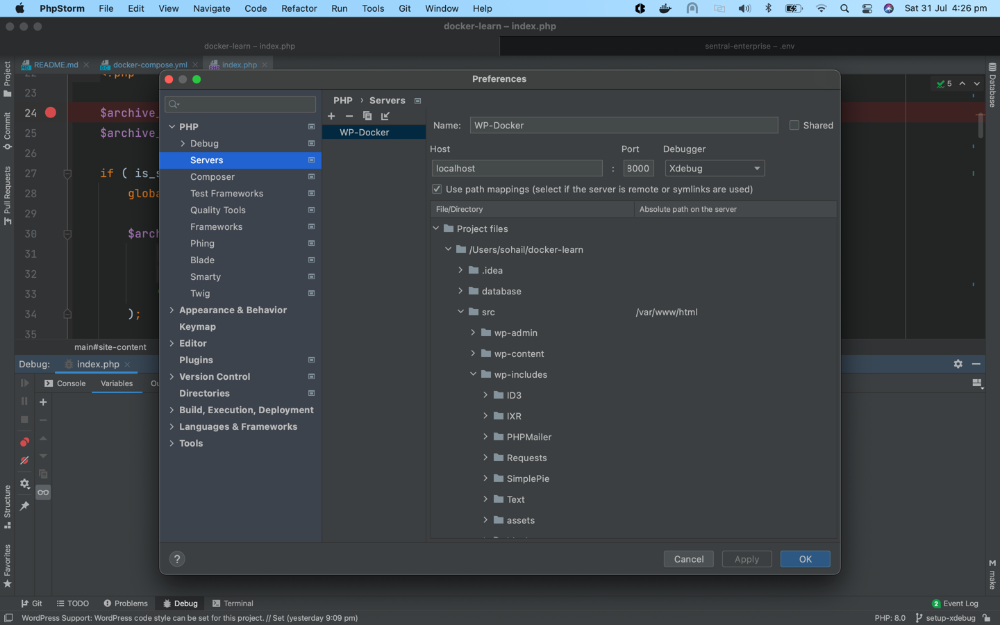

# WP-Docker
Guide to setup Wordpress with Mysql 8 and PHP 7+

## Steps to configure on local system
* Open CLI
* Make sure Docker and Docker-compose is installed on the system
  * Check by typing $`docker` and $`docker-compose` in the CLI
* Create directory and change directory to it
  * $`mkdir wp-docker`
  * $`cd wp-docker`
* $`git clone git@github.com:xohail/WP-Docker.git .`
* $`docker-compose up -d`
  * Website should be up on http://localhost:8000
  * If not please configure to the available port in **docker-compose.yml** for nginx
* if this error comes up: _The server requested authentication method unknown to the client [caching_sha2_password]_
  * `docker ps`
  * `docker exec -it <mysql_contatiner_id> /bin/bash`
  * `mysql -u root -p`
  * enter password which is `root` or `adminpassword`
  * `use mysql`
  * `select user,host from user;`
    * `ALTER USER 'admin'@'%' IDENTIFIED WITH mysql_native_password BY 'adminpassword';`
* Install Wordpress

## Steps to configure Xdebug
* `XDEBUG_CONFIG: client_host=docker.for.mac.host.internal` # is added to docker-compose.yml
* Php Storm > Preferences
* 
* Add a breakpoint to _src/wp-content/themes/twentytwenty/index.php_and refresh landing page to test

  
